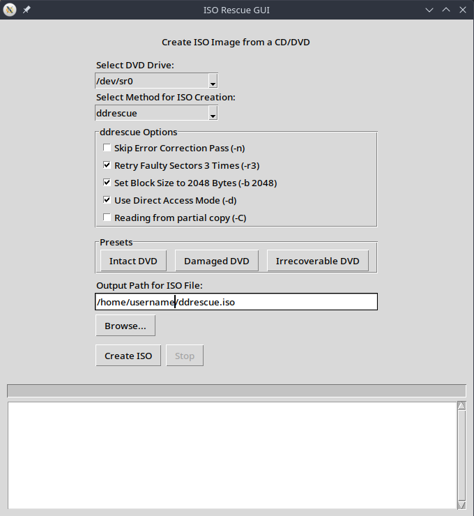

# ISO Rescue GUI

ISO Rescue GUI is a user-friendly graphical interface for creating ISO images from CDs and DVDs, with a focus on rescuing data from damaged or difficult-to-read discs.



## Features

- Support for various media types: Data CD/DVD, Audio CD, and Video/Music DVD
- Multiple ISO creation methods: dd and ddrescue
- Customizable ddrescue options for optimal data recovery
- Presets for different disc conditions (Intact, Damaged, Irrecoverable)
- Real-time progress tracking and logging
- Automatic DVD drive detection
- User-friendly interface with tooltips and helpful messages

## Prerequisites

- Linux operating system (tested on Ubuntu 20.04 and later)
- Python 3.6 or higher
- Tkinter library (usually comes pre-installed with Python)
- Sudo privileges (required for some operations)

The following tools should be installed on your system:

- ddrescue
- dvdisaster (optional, enhances recovery capabilities)
- cdparanoia (for Audio CD support)
- dvdbackup (for Video/Music DVD support)

You can install these tools on Ubuntu or Debian-based systems using:

```bash
sudo apt-get update
sudo apt-get install gddrescue dvdisaster cdparanoia dvdbackup
```

## Installation

1. Clone the repository:
   ```bash
   git clone https://github.com/ben7sys/iso_rescue_gui.git
   ```

2. Navigate to the project directory:
   ```bash
   cd iso_rescue_gui
   ```

3. Run the application with sudo privileges:
   ```bash
   sudo python3 main.py
   ```

## Usage

1. Launch the application using the command above.
2. Select the DVD drive from the dropdown menu.
3. Choose the ISO creation method (dd or ddrescue).
4. Adjust the ddrescue options if needed, or select a preset for your disc condition.
5. Specify the output path for the ISO file.
6. Click "Create ISO" to start the process.
7. Monitor the progress and log output in the application window.

## Contributing

Contributions are welcome! Please feel free to submit a Pull Request.

## License

This project is licensed under the MIT License - see the [LICENSE](LICENSE) file for details.

## Acknowledgments

- Thanks to the developers of ddrescue, dvdisaster, cdparanoia, and dvdbackup for their invaluable tools.
- Icons made by [Freepik](https://www.freepik.com) from [www.flaticon.com](https://www.flaticon.com/).